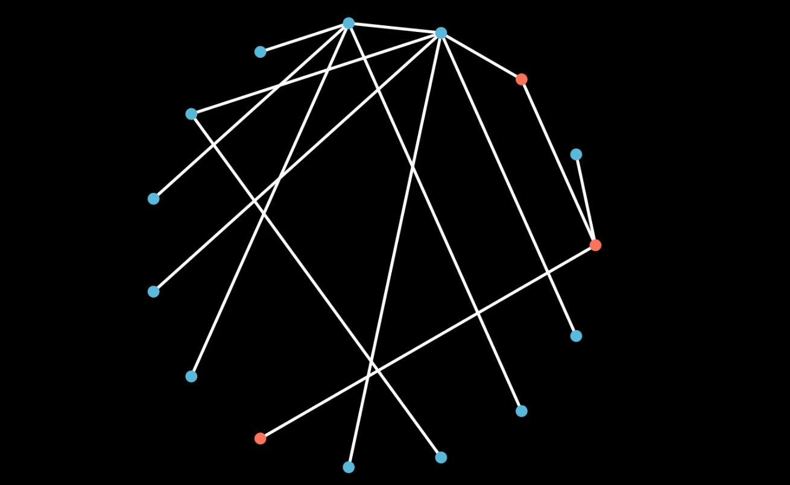
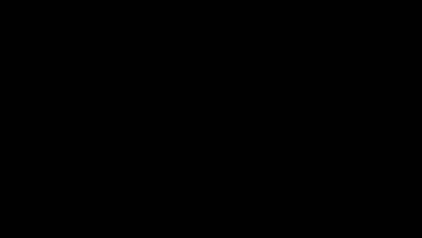

# Simulating a bipopulated minority-majority network augmented with homophily


This repository is a simulation of the **Biased Preferential Attachment Model** as proposed in the paper [Homophily and the Glass Ceiling Effect in Social Networks](https://tik-db.ee.ethz.ch/file/2a2146befd4e2d3b6717cca77995a21c/ITCSGlassCeiling.pdf)


## Some theory
The Biased Preferential Attachment Model is an extension of the Preferential Attachment Model which consists of a bi-populated majority-minority network augmented with homophily.
- Bi-populated: Two kinds of nodes exist in the network
- Majority-Minority partition: The two kinds of nodes have a difference in numbers.
- Homophily: Nodes with similar colour (or any quality in general) have higher tendency to connect.


## Demo (apologies for the bad quality gif*, full quality video is available in the `media` folder) :


## Running your own simulation
1. Install `manim` through the instructions in the [docs](https://docs.manim.community/en/stable/installation.html). (A virtual environment is suggested.)
2. Clone this repository and navigate into this folder through the terminal.
3. Change the parameters for the simulation in the first few lines of `main.py`
   1. n - The number of nodes you want to simulate
   2. r - Probability of a each new node being red.
   3. rho - Probabilty of forming an edge with a node of different colour (rho = 1 represents no homophily, rho=0 represents full homophily)
4. Run the following commands which will run the simlation and start the output video simulation.

For high quality video output(this will take time, but the output will not be pixelated):
```
manim -pqh main.py SimulateNetwork
```

For low quality, quick rendering of output (may lead to some pixelation):
```
manim -pql main.py SimulateNetwork
```
5. The simmulation video will be saved in the `media` folder for further use.


<small>* Pronounced as jif :P</small>
